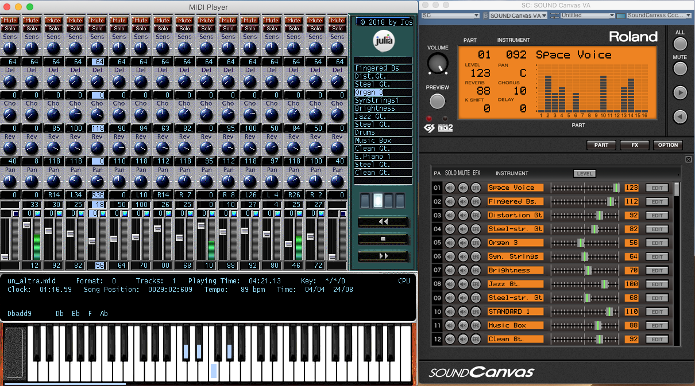
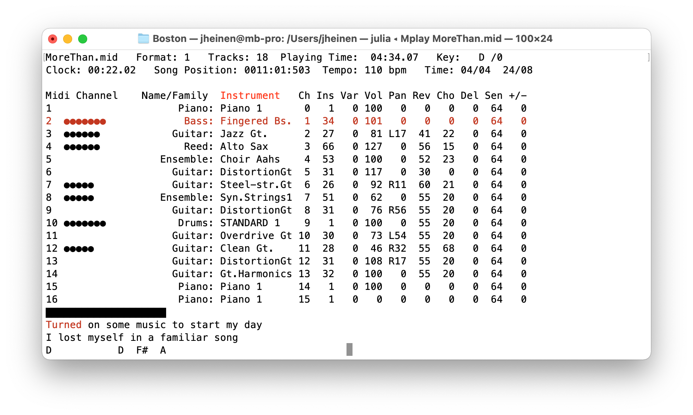

Mplay.jl
========

*Mplay* is a full functional MIDI player written in pure *Julia*.
It reads Standard MIDI Files (SMF) and sends them to MIDI devices
(or software synthesizers) while giving visual feedback.

This current version runs on *macOS* and *Windows*.
*Mplay* has been tested with *Julia* 1.5 (or later) and *GLFW* 3.3.

*macOS* and *Windows* systems come with a builtin software
synthesizer (*Apple* DLS SoftSynth, *Microsoft* GS Wavetable SW
Synth). On those systems *Mplay* runs out of the box. However,
best results can be achieved with the Roland Sound Canvas VA
software synthesizer:



**Hightlights:**

* Full functional MIDI player
* Mixer with mute and solo options
* Ability to change channel parameters (delay, chorus, reverb, pan)
* Volume sliders
* Change GM instrument sounds
* MIDI VU meter
* Show note, chord and lyrics information
* Change key, tempo
* Transport controls
* Keyboard shortcuts
* Support for Roland sound maps (SC-88 Pro, SC-88, and SC-55)

| Key                | Action                      |
|:------------------:|:---------------------------:|
| a                  | un-mute all channels        |
| b/B                | toggle/solo bass            |
| d/D                | toggle/solo drums           |
| g/G                | toggle/solo guitar(s)       |
| k/K                | toggle/solo keyboard(s)     |
| 1234567890!@#$%^   | toggle channel 1-16         |
| -/+                | decrease/increase tempo     |
| SPACE              | stop/resume song            |
| TAB                | select next channel         |
| > <                | transpose up/down, or       |
|                    | next/previous GM instrument |
|                    | (if a channel is selected)  |
| ESC                | quit Mplay                  |

**Installation:**

```
Pkg.add(url="https://github.com/JuliaMusic/Mplay.jl")
```

On macOS and Windows systems *Mplay* comes as a self-contained
package with its own wrappers for *GLFW* and *OpenGL* as well as
the required run-time libraries for the GUI and Midi subsystems.

**Usage:**

```
using Mplay
mplay(<path to midi file>)
```

Of course, you can also use *Mplay* from the command line, e.g.:

```
julia Mplay.jl <path to midi file>
```

**Internals**

*Mplay* has no innovative features - the main focus is on
simplicity and ease of use. It uses texture blitting to guarantee
highest refresh rates. That's why it responds in real-time in the
order of milliseconds, both to user interactions and MIDI events.

If, for any reason, the contained MIDI run-time doesn't work, you can
build your own binaries:

*macOS*

```
cc -shared -arch arm64 -arch x86_64 -o libmidi.dylib libmidi.c \
   -framework CoreMIDI -framework CoreAudio -framework AudioUnit \
   -framework AudioToolbox -framework Cocoa
cc -shared -arch arm64 -arch x86_64 -o libconsole.dylib libconsole.c
```
*Windows*

```
cl /c libmidi.c
link /out:libmidi.dll -dll libmidi.obj winmm.lib
cl /c libconsole.c
link /out:libconsole.dll -dll libconsole.obj
```

*Linux*

```
cc -shared -fPIC -o libmidi.so libmidi.c -lasound
cc -shared -fPIC -o libconsole.so libconsole.c
```

There is also a startup script in the `src` directory which you can symlink to simplify the use of Mplay, e.g.

```
ln -s ${HOME}/Mplay.jl/src/Mplay.sh /opt/bin/Mplay
```

With the *Mplay* command you can not only select the desired user interface, but also specify the MIDI device. For example, under *macOS* the current version offers the possibility to redirect the MIDI output to the Roland Sound Canvas VA plugin (`--device=scva`) - if installed - as an alternative to the default Apple DLS Music Device.

```
% Mplay -h
Mplay [-h|--help] [--device=midi-device] [--gui] midi-file
```

The text user interface is now enabled by default.



**How to use Mplay with Timidity++ (on Linux)**

Before you start Timidity++, you have to create a virtual MIDI device:

```
% sudo modprobe snd-virmidi
% timidity -iA
TiMidity starting in ALSA server mode
Opening sequencer port: 128:0 128:1 128:2 128:3
```

Then, in a second console window, you can setup the MIDI connections and use *Mplay* with the proper device specification, e.g.:

```
% aconnect 20:0 128:0
% aconnect -l
...
client 20: 'Virtual Raw MIDI 1-0' [type=kernel,card=1]
    0 'VirMIDI 1-0     '
	Connecting To: 128:0
...
client 128: 'TiMidity' [type=user,pid=...]
    0 'TiMidity port 0 '
	Connected From: 20:0
...
% Mplay --device=hw:1,0 <midi-file>
```

Please keep in mind: The client/device IDs on your system may differ from those shown here depending on the configuration of your Audio/MIDI interface(s).

